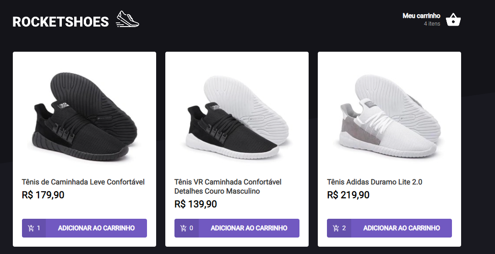

# RocketShoes

> Ignite - Criando um hook de carrinho de compras

<p align="center">
  
</p>

## Acessar o estado anterior de um componente

Como mostrado na [documentação do react](https://reactjs.org/docs/hooks-faq.html#how-to-get-the-previous-props-or-state) (apresentado no material de apoio do Ignite), pode-se acessar o estado anterior do componente com o uso de um "ref", dessa forma, a lógica de atualizar o localStorage do usuário acontece de uma forma melhor, pois o localStorage é atualizado assim que ocorre uma alteração no estado do componente, visto que a versão anterior é diferente da atual.

```javascript
const prevCarRef = useRef<Array<Product>>()
useEffect(() => {
    prevCarRef.current = cart
})
const cartPreviousValue = prevCarRef.current ?? cart
// https://reactjs.org/docs/hooks-faq.html#how-to-get-the-previous-props-or-state

useEffect(() => {
    if (cartPreviousValue !== cart) {
        localStorage.setItem('@RocketShoes:cart', JSON.stringify(cart))
    }
}, [cart, cartPreviousValue])
```

## localStorage

O uso do [localStorage Web API](https://developer.mozilla.org/en-US/docs/Web/API/Window/localStorage) permite que dados sejam persistidos no navegador do usuário, dessa maneira a informação do estado do carrinho de compras é mantido mesmo quando a página é recarregada.

## Context

Por meio do uso do hook useContext, é possível ter acesso do estado da aplicação e das funções que alteram esse estado em toda a aplicação (podendo ser usado também apenas em componentes específicos, caso seja viável).
